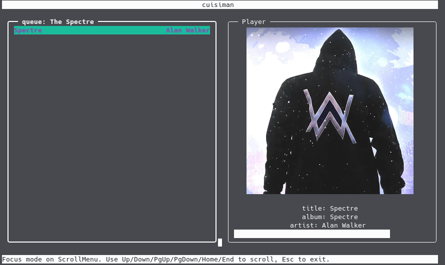

# how to use
- pip install -r requirements.txt
  - optional global shortcuts: pip install pynput
- install [gstreamer](https://github.com/sdroege/gstreamer-rs#installation)
- install [rust](https://www.rust-lang.org/tools/install)
- clone repo
- open src/opts.py, and edit the the paths (todo: automate)
  - musi_path, musimanager_directory, auto_search_under, file_explorer_base_dir
- "python src/main.py" to run (todo: improve)
- setup [ytmusicapi cookies](https://ytmusicapi.readthedocs.io/en/latest/setup.html)
  - save in path: opts.ytmusic_headers_path

# Features

- search albums on youtube and play the songs
- play songs from storage or stream from youtube seemlessly
- save songs in playlists
- track new albums from artists
- import playlists from newpipe backup zip
  -  just save the backup zip in "opts.musimanager_directory" folder and choosing the newpipe playlists option in the browser widget will show the playlists

# Navigation
- navigate using arrow keys
- press u to show current playling queue
- press g to show a menu for selected item
- press f to sort items (takes input from user)
- press p to pause playing song
- press h, j, k, l while playing for prev_song, seek-10, seek+10, next_song

# temporary fixs
  - save some png image at opts.default_album_art (cuz i donno where to get free default image for album art)